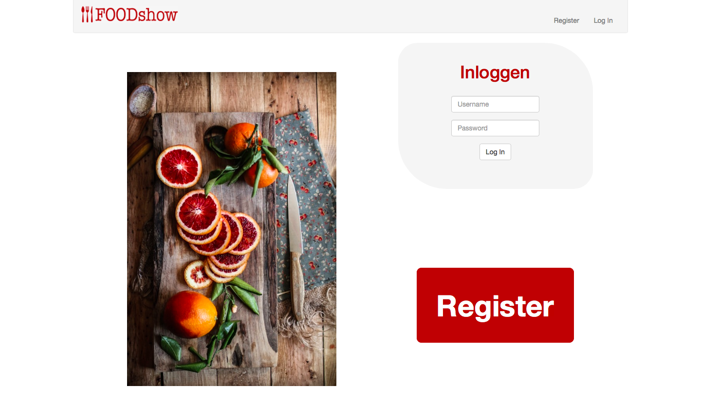
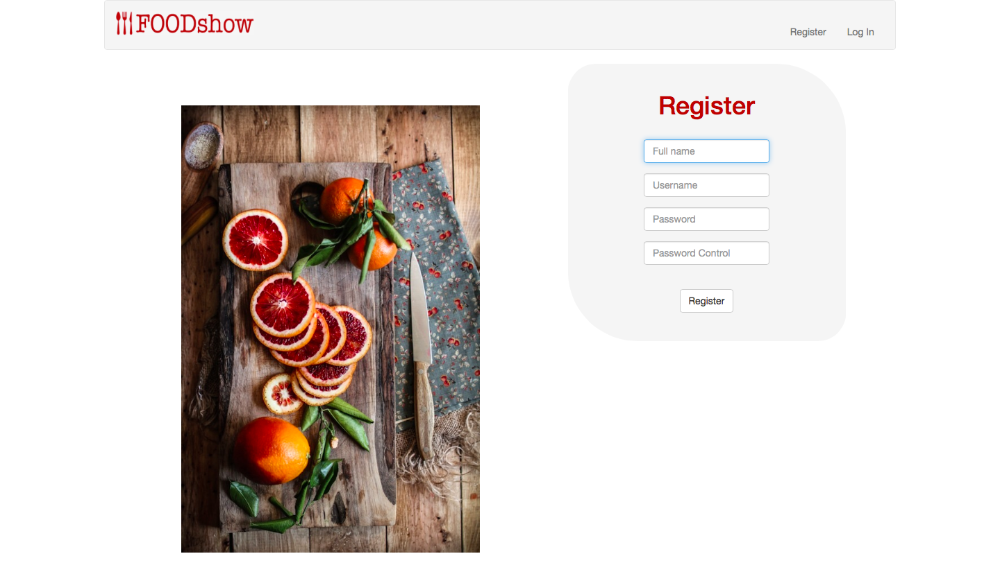
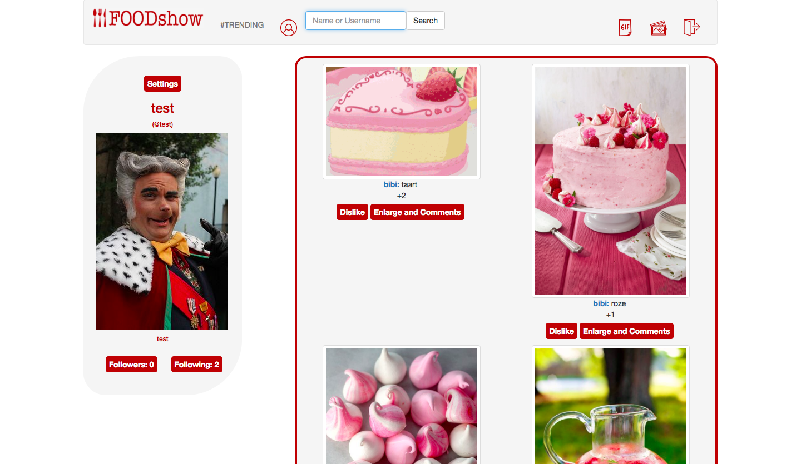
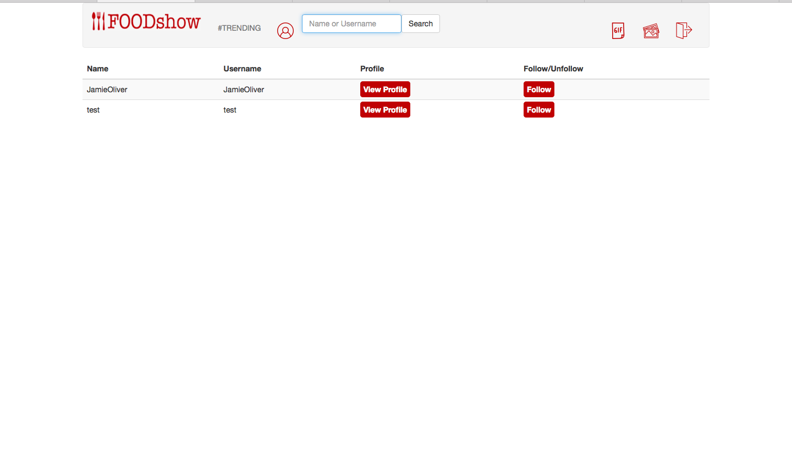

# WEBik

# Technisch Ontwerp van FOODshow

### Bibi Kok 11063394

### Ahmed Moenna 11043768

### Paul van der Pijl

## BELANGRIJK VOOR GEBRUIK:"" pip install giphy client "" UITVOEREN

### Samenvatting
Het doel van onze webapplicatie is om een overzicht te krijgen van afbeeldingen en gifjes die:
1. op dit moment trending zijn
2. door de mensen die jij volgt worden geplaatst

Het idee is uniek omdat dit een webapplicatie is die gericht is op het delen van foto's met anderen en waarbij er een overzichtelijk aanbod wordt gegeven van meerdere foto's tegelijk. Zo kunnen bezoekers in een oogopslag beslissen welke foto's ze wel of niet interessant vinden. Verder kunnen bezoekers aangeven dat ze foto's leuk vinden door deze te 'liken', de meest gelikete foto's verschijnen op een aparte trending pagina.

#### Controllers
Verschillende functies waarbij aangegeven staat of deze GET/POST zijn:

| Route                     | Omschrijving                                                                                  | GET / POST     |
| ------------------------- |:-------------------------------------------------------------------------------------------   | --------------:|
| **register()**            | Account aanmaken                                                                              |  POST          |
| **login()**               | Inloggen in systeem                                                                           |  POST          |
| **logout()**              | Uitloggen en terug naar beginpagina                                                           |  session kill  |
| **search()**              | Zoeken naar personen om hun profielpagina te bekijken en hen daar ook te volgen               |  GET           |
| **uploaden()**            | Foto uploaden op eigen profielpagina                                                          |  POST          |
| **index()**               | Geeft profiel weer van de huidige gebruiker                                                   |  POST          |
| **change_password()**     | Wachtwoord wijzigen                                                                           |  POST          |
| **followers()**           | Laat per gebruiker een lijst zien met al zijn volgers                                         |  POST          |
| **following()**           | Laat per gebruiker een lijst zien met iedereen die hij volgt                                  |  POST          |
| **add_following()**       | Voegt de gebruiker die jij net hebt gevolgd toe aan jou volgers                               |  POST          |
| **profile()**             | Weergeeft profiel van een andere gebruiker                                                    |  POST          |
| **gif()**                 | Haal een gif uit de Giphy API                                                                 |  POST          |
| **gif_uploaden()**        | Upload gif naar het profiel van de gebruiker                                                  |  POST          |
| **upload_file()**         | Een link voor het makkelijk terughalen van fotos                                              |  POST          |
| **like()**                | Met deze functie kan een gif of foto leuk gevonden worden                                     |  POST          |
| **dislike()**             | Met deze functie kan je je like terugtrekken                                                  |  POST          |
| **timeline()**            | Laat alle uploads van de mensen die jij volgt zien (kom je via logo)                          |  POST          |
| **settings()**            | Ga naar instellingen waar je je bio/profiel foto kan veranderen                               |  POST          |
| **trending()**            | Laat van alle gebruikers de uploads zien gesorteerd op meeste likes                           |  POST          |
| **delete()**              | Verwijder een geuploade foto of gif van je profiel                                            |  POST          |
| **profile_picture()**     | Upload een profiel foto                                                                       |  POST          |
| **Unfollow()**            | Ontvolg een account                                                                           |  POST          |
| **bio()**                 | Voeg een bio toe aan je profiel                                                               |  POST          |
| **add_comment()**         | Voeg een comment toe aan een foto                                                             |  POST          |
| **show_comment()**        | Laat comment van een foto zien en bekijk foto beter                                           |  POST          |

#### Views
Inloggen Voorbeeld

Register Voorbeeld

Trending Voorbeeld

Volgers Voorbeeld

#### Models/Helpers
Lijst van helper functie en hun omschrijving:
* **apology():** Bij fouten op de webapplicatie krijg je een foutmelding.
* **login_required():** Maakt route waarbij inloggen verplicht is
* **allowed_file():** Controleer of file toegestaan is
* **get_id():** Geeft de huidige gebruikers id
* **following_users():** Geeft gebruikers die de huidige gebruiker volgen
* **liked_photos():** Geeft gelikete fotos terug.

#### Plugins/Frameworks
Een korte lijst van plugins en frameworks:
* Navigatie-bar: http://getbootstrap.com/docs/4.0/components/navbar/
* buttons: http://getbootstrap.com/docs/4.0/components/buttons/
* GIF’s: https://developers.giphy.com/docs/

##### Verdeling
Als we terugblikken op het project na afloop zijn er nauwelijks onderdelen in de website die bijna volledig alleen zijn gemaakt door een lid van het team. Het overgoten deel van de functies hebben we gemaakt tijdens de dagelijkse bijeenkomsten. Het vragen en geven van hulp was iets dat elke dag voorkwam. Wel was het zo dat er een aantal onderdelen waren waar een bepaald lid meer tijd aan besteed dan de rest. Hieronder een korte opsomming van de wat grotere taken waren:

Bibi: Het uploaden van foto’s, lay-out , toevoegen van comment’s
Paul: De settings page en alles wat daarbij hoort (profiel bijwerken), de zoek functie en profiel page
Ahmed: Gif implementatie, like en dislike functie
